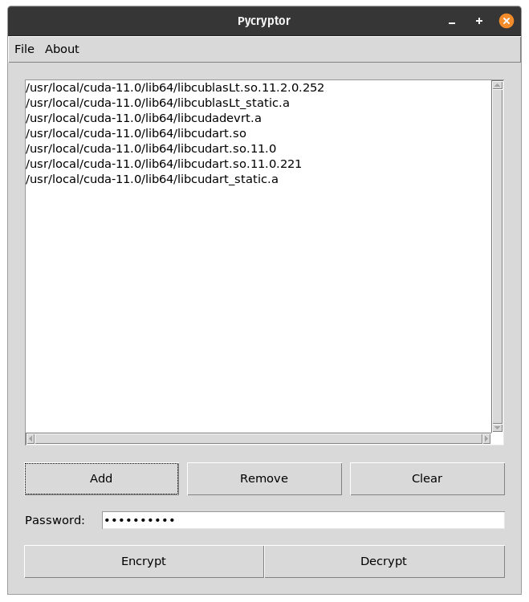

# Pycryptor - The File Vault

Pycryptor is a Python based high performance file encryption software.

## Features

 - Supports multiple AES modes.
 - Supports multiple cryptographic backends.
 - Very fast encryption and decryption of files.
 - GUI based on lightweight Tk. No additional dependencies required.

## Pycryptor Preview

### Linux

  

## The `locker` modules

**The `locker` modules have been removed.**

[`PyFLocker`](https://github.com/arunanshub/pyflocker) is used to provide the encryption and decryption functionality.

## Future plans for the App

A small checklist in case I forget my tasks!

- [x] Improve the large/multiple file locking speed, and prevent it from hanging.
- [x] Add some documentation to the app source code.
- [x] Simplify the code base.
- [x] Add minimal and configurable logging in app.
- [ ] Add functionality to work with directories.
- [ ] Add user-made themes capability (as JSON files).
- [x] Deprecate the locker in favour of better API.
  - [x] Remove the locker files.

and maybe...

- [ ] convert it to a standalone app?

Removed tasks:

- [x] (Removed, Provided by `PyFLocker`) Add multiple backend support for the app.
- [x] (Removed) Shift the hyperlinks in the app to some better place.
- [x] (Removed) Add documentation to the `lockers`.
- [x] (Removed) Perform some cleanup of the backend `lockers`.
- [x] (Removed) Make `crylocker.py` compatible with `pylocker.py`.
